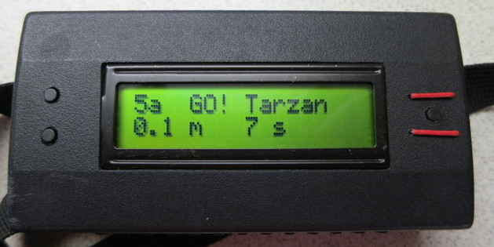

AsTra
=====

Ascent Tracker "AsTra" is an Arduino-based altitude data logger for
(indoor)climbing.

 

AsTra is a smallish (12x6x2.5 cm, 200 g) wearable device to record
altitude (based on barometric pressure) four times a second to an
SD card. For convenience also time, name of the climber and grade of
the route are selectable and stored with every ascent. The data are
processed with a Perl program to yield daily ascent curves (with
[dygraphs](http://dygraphs.com/)) for every climber.

The [demo graph for Tarzan](http://www.helsinki.fi/~syrjanen/AsTra/Tarzan/2014-05-27.html)
displays each ascent as a curve, height versus time. You can select
which ascents are visible, zoom in with mouse etc. Monthy and yearly
(statistics)[http://www.helsinki.fi/~syrjanen/AsTra/Tarzan/Stats.html] are calculated for every climber.

Check these directories for more information on design and
building the hardware and software:

- [hw](hw): AsTra hardware and Arduino software
- [tools](tools): Linux software and tools for graphing AsTra data

Pictures, demo video and some notes on building AsTra can be found
in [AsTra image library](http://pars.kuvat.fi/kuvat/AsTra/?pw=AsTra)

&copy; Seppo Syrjänen 2014,2016

*Contact: ascend dot tracker at gmail dot com*
